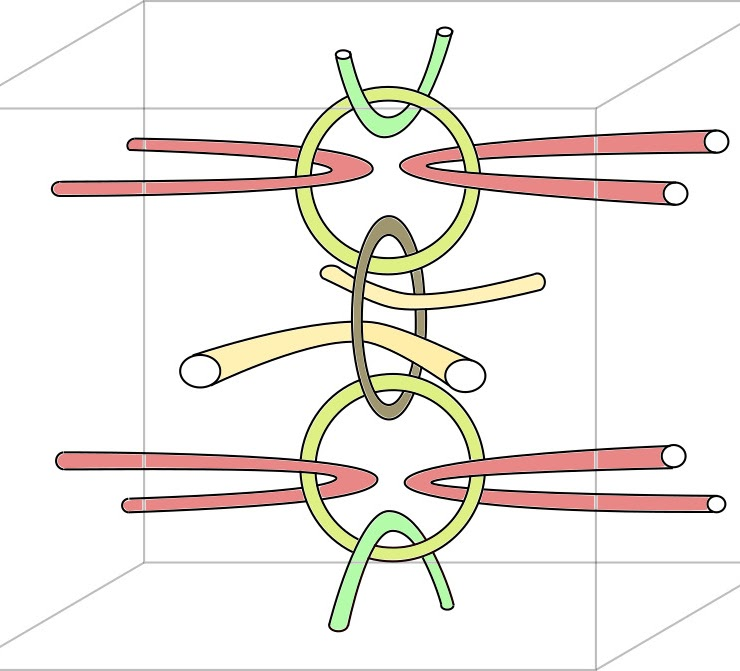

    <strong>My research interests include:</strong>
    <ul style="margin-top: 10px; line-height: 1.6;">
        <li>Differential geometric aspects of symmetric spaces</li>
        <li>Quantitative properties of Anosov representations</li>
        <li>Geometry of character varieties</li>
        <li>Geometric structures</li>
    </ul>

---

## Preprints

    
    
    

        <strong>Epstein-Poincaré surfaces for G-opers.</strong> 
        <em>Preprint (2026). <a href="https://arxiv.org/abs/2601.09936">[arXiv:2601.09936]</a> (submitted).</em>
        

            <strong>Summary:</strong> We extend the notion of Epstein-Poincaré surfaces to G-opers and use them to understand the holonomy of an oper near the Fuchsian oper.
        

    

## Publications

    
    
    

        <strong>Uniform foliations with Reeb components.</strong> 
        <em>Algebraic & Geometric Topology 23:9 (2023), 4379–4400. <a href="https://msp.org/agt/2023/23-9/agt-v23-n9-p10-s.pdf">[Journal]</a> <a href="LINK_TO_ARXIV">[arXiv]</a>.</em>
        

            <strong>Summary:</strong> We show examples and control the behavior of uniform foliations with Reeb components in closed three-manifolds.
        

    

---

## In Preparation

<ul>
    <li style="margin-bottom: 10px;">
        <strong>Quantitative entropy decay for \(SL_3 (\mathbb{R})\) pants representations.</strong> 
        <em>Joint with <a href="https://joacolej.github.io">Joaquin Lejtreger</a>.</em>
    </li>
    <li>
        <strong>On ideal triangle group representations onto \(SL_3 (\mathbb{C})\).</strong> 
        <em>Joint with <a href="https://joacolej.github.io">Joaquin Lejtreger</a>.</em>
    </li>
</ul>
