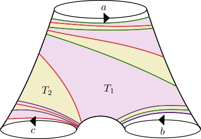
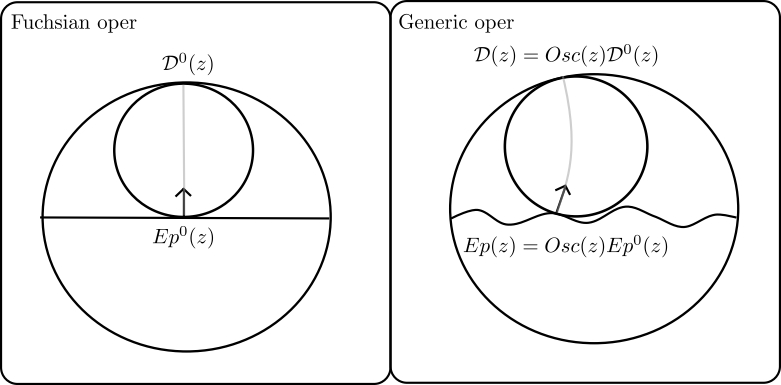
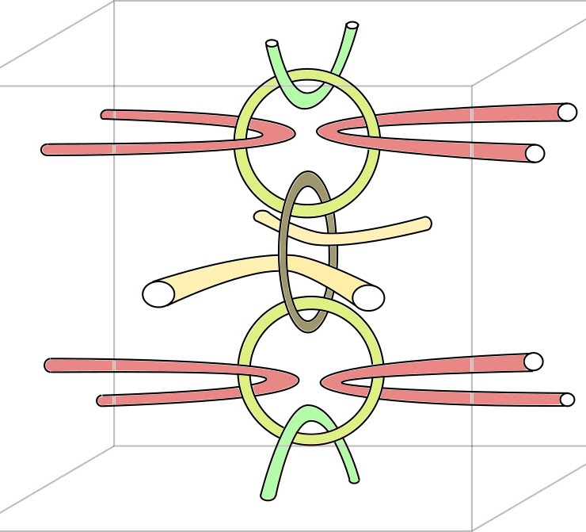

My main interest is the study of discrete subgroups of Lie groups, particularly Anosov representations. I enjoy thinking about problems that draw on tools from many areas, especially dynamics, geometry, and topology. 

---

## Preprints

    
    
    

        <strong>On separated families of Anosov representations.</strong> 
        <em>Joint with <a href="https://joacolej.github.io">Joaquin Lejtreger</a>.</em>
        <em>Preprint (2026). <a href="https://arxiv.org/abs/2604.18994">[arXiv:2604.18994]</a> (submitted).</em>
    

    
    
    

        <strong>Epstein-Poincaré surfaces for G-opers.</strong> 
        <em>Preprint (2026). <a href="https://arxiv.org/abs/2601.09936">[arXiv:2601.09936]</a> (submitted) <a href="https://lemajo.github.io/pdfs/addendum-ep.pdf">[Addendum]</a>.
        </em>
    

## Publications

    
    
    

        <strong>Uniform foliations with Reeb components.</strong> 
        <em>Algebraic & Geometric Topology 23:9 (2023), 4379–4400. <a href="https://msp.org/agt/2023/23-9/agt-v23-n9-p10-s.pdf">[Journal]</a> <a href="LINK_TO_ARXIV">[arXiv]</a>.</em>
    

---

## In Preparation
Available upon request.

<ul>
    <li>
        <strong>Zariski-density of discrete subgroups and their flag limit sets.</strong> 
        <em>Joint with <a href="https://www.math.uni-bonn.de/people/douba/">Sami Douba</a> and <a href="https://www.ihes.fr/~/galiay/">Blandine Galiay</a>.</em>
    </li>
</ul>

<ul>
    <li>
        <strong>Convex projective structures in the ideal reflection orbifold from the inside.</strong> 
        <em>Joint with <a href="https://joacolej.github.io">Joaquin Lejtreger</a>.</em>
    </li>
</ul>
